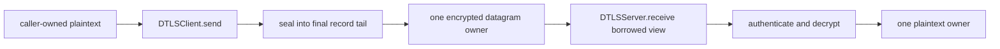

# DTLS send/receive copy and allocation budget

This manually invoked benchmark measures the canonical `DTLSClient.send(_:)` and
`DTLSServer.receive(_:from:)` application-record paths. It is not part of any test
target and its executable product exists only when
`SWIFT_TLS_ENABLE_BENCHMARKS=1` is set.



Handshake and one warm-up operation occur outside the measured region. Receive
fixtures also generate their encrypted datagrams before measurement. The
allocation probe measures 16 and 64 operations and uses their difference to
remove fixed process/probe setup. Measurements at 1, 1,200, and 16,384 payload
bytes distinguish one required output owner from accidental payload-sized
materialization.

Run the pinned formal measurement from the package root:

```bash
TOOLCHAINS=org.swift.64202607231a \
DEVELOPER_DIR=/Applications/Xcode-beta.app/Contents/Developer \
python3 Benchmarks/DTLSCopyBudget/run_benchmark.py --formal
```

## 2026-08-06 result

Swift `swift-6.4.x-DEVELOPMENT-SNAPSHOT-2026-07-23-a`, compiler commit
`ef761e567dc94ee`, arm64 macOS 26 deployment target:

| Direction | Payload | Allocations/op | Allocated bytes/op | Dynamic bulk-copy bytes/op | Median ns/op | Gate |
|---|---:|---:|---:|---:|---:|---:|
| Send | 1 | 4 | 180 | 1,064 | 1,146.16 | Pass |
| Send | 1,200 | 4 | 1,379 | 1,064 | 1,361.98 | Pass |
| Send | 16,384 | 4 | 16,563 | 800 | 3,780.93 | Pass |
| Receive | 1 | 3 | 110 | 1,064 | 1,124.35 | Pass |
| Receive | 1,200 | 3 | 1,309 | 1,064 | 1,377.93 | Pass |
| Receive | 16,384 | 3 | 16,493 | 800 | 3,627.93 | Pass |

The send allocation budget is exactly `payload + 179` bytes/op; receive is
`payload + 109`. Both output-owner slopes are `1.0 byte / payload byte`, so
neither direction creates a second payload-sized owner. Dynamic libc bulk-copy
bytes do not grow with payload size (both observed slopes `-0.017387`); remaining
bounded copies are fixed-size crypto/runtime work. Every measured allocation has
a matching free.

Artifact:
[`Results/20260806T142358Z-native-dtls-copy-budget.json`](Results/20260806T142358Z-native-dtls-copy-budget.json).
The artifact records that it was captured from the current uncommitted working
tree; the release gate must be rerun after the final commit so the recorded
source identity is immutable.
