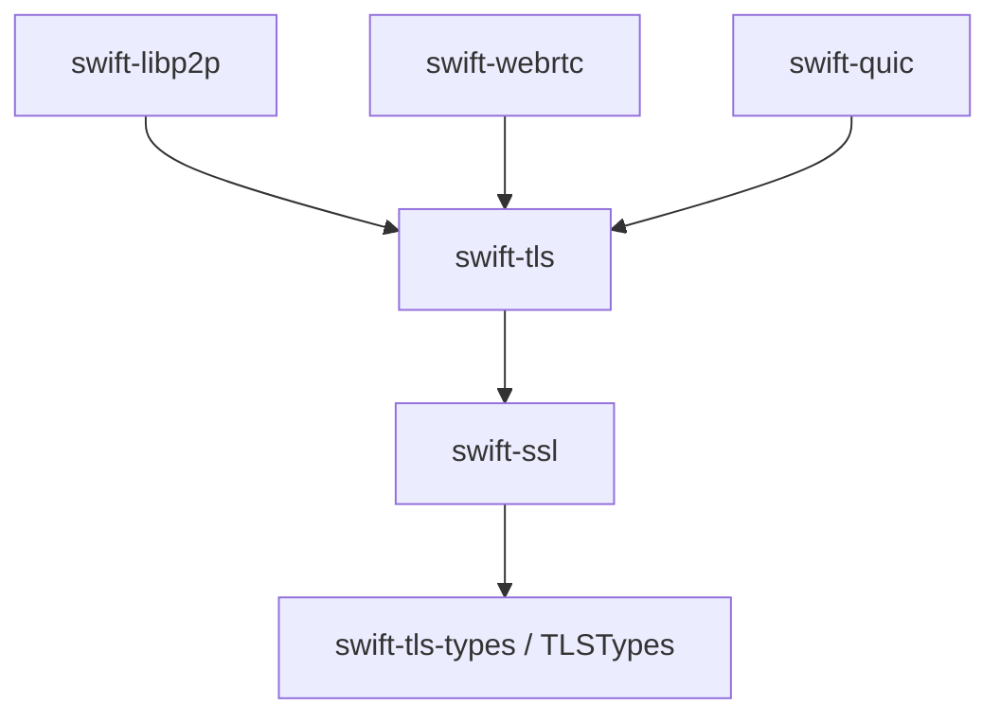

# swift-tls

Pure Swift session facade for TLS 1.3 ([RFC 8446](https://www.rfc-editor.org/rfc/rfc8446)), DTLS 1.2 WebRTC ([RFC 6347](https://www.rfc-editor.org/rfc/rfc6347)), and QUIC TLS. The currency is `[UInt8]` / `Span<UInt8>`; this is an Embedded-first package.

> **Release status.** Current release: `1.3.3`.

## Ecosystem responsibility

`swift-tls` is the public session boundary for the TLS protocol family. It exposes separate
Stream TLS, DTLS, and QUIC TLS profiles and delegates their cryptographic,
PKI, wire, transcript, key-schedule, record, and handshake mechanisms to
[swift-ssl](https://github.com/1amageek/swift-ssl). It does not own transport
I/O or a second TLS implementation.



`swift-tls-types` owns only shared TLS vocabulary. `swift-ssl` owns
cryptography, PKI, protocol mechanisms, and ownership-backed secret/borrow
contracts; this package owns the public session contracts above it.

All TLS/DTLS wire codecs, transcript/key schedule, handshake, replay, flight,
cookie, exporter, and record mechanisms are owned by `swift-ssl`. This package
only adapts those mechanisms to session configuration, caller-owned transport
bytes, timers, identity/trust capabilities, and one typed facade error. See the
[workspace secure-transport architecture](../../SECURE_TRANSPORT_ARCHITECTURE.md)
for the ownership contract.

## Features

### TLS 1.3

- Full TLS 1.3 handshake (client and server)
- Cipher suites: `AES-128-GCM-SHA256`, `AES-256-GCM-SHA384`, `ChaCha20-Poly1305-SHA256`
- Key exchange: X25519, P-256, P-384
- HelloRetryRequest
- Mutual TLS (mTLS)
- The CertificateVerify proof-of-possession signature is **always verified** in the core whenever the peer presents a certificate; the `verifyPeer` configuration flag controls **only** X.509 chain / trust-anchor (or RFC 7250 raw-key) validation, never the handshake signature
- X.509 certificate chain validation (host) and RFC 7250 raw-public-key authentication (host + Embedded)
- Facade identity schemes: ECDSA P-256 and Ed25519; the current public facade does not import P-384 private keys. External capability requests expose only the schemes advertised by the canonical `swift-ssl` handshake.
- Transport-agnostic, sans-IO design (TCP, QUIC, etc.)
- TLS 1.3 NewSessionTicket issuance and one-shot PSK resumption state for
  stream clients and servers
- `Span<UInt8>` input lets adapters feed byte views without pre-materializing `Data`
- Swift 6 strict concurrency (`Sendable`, lock-based facade)

### DTLS 1.2 WebRTC profile

- Full DTLS 1.2 handshake (client and server)
- Cipher suite: `ECDHE-ECDSA-AES128-GCM-SHA256`
- Mutual authentication: the server requires/verifies a client certificate via `DTLSConfiguration(identity:requireClientCertificate:)`; the client's CertificateVerify proof-of-possession is verified before completion
- Cookie exchange for DoS protection (RFC 6347 §4.2.1); HelloVerifyRequest cookies are bound to the client transport address and minted/verified with an association-lifetime random secret (fail-closed)
- Anti-replay protection with 64-bit sliding window (RFC 6347 §4.1.2.6); bad-MAC records are discarded while datagram processing continues
- Non-fatal record anomalies (bad MAC, replay, too-old, malformed) are surfaced via `DTLSOutput.anomalies` instead of being silently swallowed
- Handshake fragment reassembly is bounded to resist memory-exhaustion DoS
- Epoch-based key management with repeated read/write rekey, per-epoch sequence
  reset, anti-replay reset, and one bounded prior write epoch for retained-flight
  retransmission
- Flight retransmission with exponential backoff (driven by `handleTimeout()`)
- Certificate fingerprint verification is performed by `swift-webrtc` after the
  DTLS peer proof succeeds; this facade only exposes the authenticated peer
  certificate material and SRTP exporter output.

### Cryptographic backend

The unified crypto provider uses `swift-ssl/SSLCrypto` through the shared
`P2PCoreCrypto` contracts on Native, WASM, and Embedded. Certificate parsing and
fingerprint binding are supplied by the caller (WebRTC owns its signaling-bound
identity policy); this facade does not select BoringSSL, CryptoKit, or a host-only
certificate backend.

## DTLS zero-copy benchmark

The canonical DTLS send path encrypts directly into its final wire-record owner.
The receive path borrows the caller's encrypted datagram through parsing and AEAD
authentication, then writes into the final plaintext owner. The manually enabled
benchmark is kept outside normal test targets.

| Direction | Payload | Allocations/op | Allocated bytes/op | Median |
|---|---:|---:|---:|---:|
| Send | 1 byte | 4 | 180 | 1,146.16 ns/op |
| Send | 1,200 bytes | 4 | 1,379 | 1,361.98 ns/op |
| Send | 16,384 bytes | 4 | 16,563 | 3,780.93 ns/op |
| Receive | 1 byte | 3 | 110 | 1,124.35 ns/op |
| Receive | 1,200 bytes | 3 | 1,309 | 1,377.93 ns/op |
| Receive | 16,384 bytes | 3 | 16,493 | 3,627.93 ns/op |

Both measured allocation-byte slopes are exactly `1.0`, proving one
payload-sized output owner in each direction and no encrypted-datagram or
encrypted-fragment materialization. See the
[benchmark contract and artifact](Benchmarks/DTLSCopyBudget/README.md).

## Requirements

- Swift 6.4 development snapshot `2026-07-23` (tools version `6.4`)
- macOS 26+ / iOS 26+ / tvOS 26+ / watchOS 26+ / visionOS 26+

## Installation

Add swift-tls to your `Package.swift`:

```swift
dependencies: [
    .package(
        name: "swift-tls",
        url: "https://github.com/1amageek/swift-tls.git",
        from: "1.3.3"
    ),
]
```

Then depend on the facade product:

```swift
.target(
    name: "YourTarget",
    dependencies: [
        .product(name: "TLS", package: "swift-tls"),
        // Wire codecs are opt-in products of swift-ssl, not session products.
        // .product(name: "TLSWire", package: "swift-ssl"),
        // .product(name: "DTLSWire", package: "swift-ssl"),
    ]
)
```

### Embedded Swift

The facade's release runtime path is exercised by the WebRTC portable probe,
which drives the `TLS` product through a mutual DTLS-SRTP/H.264 round trip. The
cores (engine / wire / crypto schedule / provider) and the facade are dual-built;
the portable facade accepts the same DER + raw-key identity contract as Native,
with `P2PCoreDER` SPKI extraction and fail-closed validation. `FacadeLock` is the
same `Synchronization.Mutex` contract on Native, WASM, and Embedded.

```bash
# Normal WASI (run from this package directory)
TOOLCHAINS=org.swift.64202607231a \
P2P_CORE_WASM=1 \
swift run \
    --package-path ../swift-webrtc \
    --swift-sdk swift-6.4.x-DEVELOPMENT-SNAPSHOT-2026-07-23-a_wasm \
    --build-system swiftbuild \
    --configuration release \
    WebRTCPlatformIntegrationProbe

# Embedded WASI (run from this package directory)
TOOLCHAINS=org.swift.64202607231a \
P2P_CORE_EMBEDDED=1 \
swift run \
    --package-path ../swift-webrtc \
    --swift-sdk swift-6.4.x-DEVELOPMENT-SNAPSHOT-2026-07-23-a_wasm-embedded \
    --build-system swiftbuild \
    --configuration release \
    -debug-info-format none \
    -Xlinker -lswiftUnicodeDataTables \
    WebRTCPlatformIntegrationProbe
```

## Architecture notes

- Build with the pinned Swift 6.4 snapshot and matching Swift SDK.
- `TLS` and `QUICTLS` are the public products of this package. `TLSWire`,
  `DTLSWire`, `DTLSHandshake`, and `DTLSRecord` are published by `swift-ssl`;
  this facade does not expose a duplicate wire or record implementation.
- DTLS retransmission now exposes a generation token. Schedule from
  `retransmissionState` and call `handleTimeout(generation:)`; stale timer
  callbacks return `.superseded` instead of retransmitting a newer flight.
- WebRTC callers configure `DTLSSRTPConfiguration`, read the authenticated
  `negotiatedSRTPProtectionProfile`, and derive directional material with
  `srtpKeyingMaterial()` only after the handshake is established.
- `P2PCoreBytes` and `P2PCoreCrypto` are owned and published by `swift-ssl`;
  `P2PCrypto` remains the policy/provider adapter from `swift-p2p-core`.

## Quick Start

### TCP client (TLS 1.3)

```swift
import TLS

let config = TLSConfiguration.client(serverName: "example.com")
let tls = try TLSClient(configuration: config)

// 1. Start the handshake → send the ClientHello.
let hello = try tls.startHandshake()
try await tcp.send(hello)

// 2. Feed peer bytes until the handshake completes.
while !tls.isEstablished {
    let received: [UInt8] = try await tcp.receive()
    let output = try tls.receive(received.span)
    if !output.bytesToSend.isEmpty { try await tcp.send(output.bytesToSend) }
}

// 3. Application data.
let message = Array("Hello".utf8)
let records = try tls.send(message.span)
try await tcp.send(records)

// 4. Graceful close.
try await tcp.send(try tls.close())
```

`receive(_:)` / `send(_:)` take a `Span<UInt8>`. Obtain one from the `.span`
property of a stable `[UInt8]` (or `Bytes`) binding. A span is borrowed only for
the synchronous call. DTLS send seals directly into its final record owner, and
DTLS receive does not materialize the encrypted datagram before authentication.
Stream TLS owns buffering according to its record-stream contract.

### DTLS 1.2 client (UDP)

```swift
import TLS

// ECDSA P-256 identity: DER leaf certificate + raw 32-byte private key.
let identity = TLSIdentity(
    privateKey: rawP256PrivateKey,                 // [UInt8]
    keyType: .ecdsaP256,
    certificateChain: [Certificate(der: leafDER)]
)
let config = DTLSConfiguration(identity: identity, requireClientCertificate: true)
let dtls = try DTLSClient(configuration: config)

// Start the handshake → send the ClientHello datagram(s).
for datagram in try dtls.startHandshake() {
    try await udp.send(datagram)
}

// Process datagrams until the handshake completes.
while !dtls.isEstablished {
    let received: [UInt8] = try await udp.receive()
    let output = try dtls.receive(received.span)
    for datagram in output.datagramsToSend { try await udp.send(datagram) }
    // On a flight timeout, use the current generation token:
    //   let result = try dtls.handleTimeout(generation: dtls.retransmissionState.generation)
}

// Application data.
let message = Array("Hello".utf8)
let datagram = try dtls.send(message.span)
try await udp.send(datagram)

// Graceful close.
try await udp.send(try dtls.close())
```

### DTLS 1.2 server (UDP)

```swift
import TLS

let config = DTLSConfiguration(identity: identity, requireClientCertificate: true)
let dtls = try DTLSServer(configuration: config)

// A server has nothing to send until the first ClientHello arrives.
_ = try dtls.startHandshake()

while !dtls.isEstablished {
    let (data, clientAddr): ([UInt8], [UInt8]) = try await udp.receiveFrom()
    // remoteAddress binds the HelloVerifyRequest cookie.
    let output = try dtls.receive(data.span, from: clientAddr.span)
    for datagram in output.datagramsToSend { try await udp.send(datagram, to: clientAddr) }
}
// Now ready for application data.
```

`requireClientCertificate: true` makes the server fail the handshake unless the client presents a certificate and proves possession of its private key via a valid CertificateVerify. Peer-authenticated deployments (WebRTC / libp2p) must set this.

## Products

| Product | Import | Visibility | Description |
|---------|--------|------------|-------------|
| **TLS** | `import TLS` | public | Tier-1 facade — the only module a normal user imports. `TLSClient` / `TLSServer` / `DTLSClient` / `DTLSServer`. |
The wire products are published by `swift-ssl` (`TLSWire`, `DTLSWire`,
`DTLSHandshake`, and `DTLSRecord`) for callers that need explicit codec seams.
This package publishes only the session products `TLS` and `QUICTLS`.

### Public API (Tier-1 facade)

`TLSClient`, `TLSServer`, `DTLSClient`, and `DTLSServer` are each a `final class` and `Sendable`. They wrap a value-type, sans-IO engine behind a lock (the facade is "the caller that locks"). The currency is `[UInt8]` / `Span<UInt8>`; `Data` appears only as a host-only convenience (e.g. WebRTC fingerprint formatting).

```swift
// Construction (typed throws)
init(configuration: TLSConfiguration) throws(TLSError)    // TLSClient / TLSServer
init(configuration: DTLSConfiguration) throws(TLSError)   // DTLSClient / DTLSServer
```

All facade transitions are synchronous and sans-I/O. Transport adapters own asynchronous reads and writes outside the session mutex.

| Method | TLS | DTLS |
|--------|-----|------|
| `startHandshake()` | `throws(TLSError) -> [UInt8]` | `throws(TLSError) -> [[UInt8]]` |
| `receive(_:)` | `throws(TLSError) -> TLSOutput` | `throws(TLSError) -> DTLSOutput` |
| `send(_:)` | `throws(TLSError) -> [UInt8]` | `throws(TLSError) -> [UInt8]` |
| `sendNewSessionTicket(...)` | `throws(TLSError) -> TLSIssuedSessionTicket` (server) | — |
| `requestKeyUpdate(requestPeerUpdate:)` | `throws(TLSError) -> [UInt8]` | — |
| `close()` | `throws(TLSError) -> [UInt8]` | `throws(TLSError) -> [UInt8]` |
| `handleTimeout()` | — | `throws(TLSError) -> [[UInt8]]` (flight retransmission) |

`receive(_:)` takes a `Span<UInt8>`. `DTLSServer.receive(_:from:)` additionally takes `from remoteAddress: Span<UInt8>` for the HelloVerifyRequest cookie binding.

Stream sessions also expose `receiveStep(_:)` and `resume(_:)` for capability
requests that must be answered by the caller (trust evaluation, credential
selection, or signing). A normal configured raw-public-key provider resolves
those requests internally; callers only need this pair when they own the policy
or private-key operation.

`TLSServer.sendNewSessionTicket(...)` returns the encrypted record bytes and the
paired `TLSResumptionState`. Deliver the bytes to the client. The client reports
`TLSOutput.sessionTicketReceived` and exposes its own state through
`TLSClient.takeResumptionState()`. Construct the next client and server session
with their respective states; each state is one-shot and is protected by its own
`Mutex` until consumed.

```text
first server ── sendNewSessionTicket ──> ticket bytes ──> first client
      │                                      │
      └─ server state                         └─ client state
             │                                      │
       next TLSServer                         next TLSClient
```

When an external X.509 policy callback is configured, its canonical path
validator and application policy callback are snapshotted under the session
lock, then invoked outside that lock. The TLS state machine is resumed under
the lock only after the callback response is converted into a typed canonical
capability response. Configurations using only built-in trust anchors keep
that validator inside the canonical `swift-ssl` engine path.

Connection state and peer material:

- `var isEstablished: Bool` — handshake complete.
- TLS: `var negotiatedALPN: String?`, `var peerCertificates: [[UInt8]]?` (DER chain, leaf first), `var peerIdentity: PeerIdentity?` (from the injected validator).
- DTLS: `var isClosed: Bool`, `var remoteCertificateDER: [UInt8]?`; WebRTC computes and verifies the signaling-bound fingerprint in its own layer.

All errors surface as one closed, typed-throws `TLSError` enum (`handshakeNotComplete`, `connectionClosed`, `protocolFailure`, `fatalAlert`, `verificationFailed`, `invalidConfiguration`, `bufferOverflow`, `concurrentReceiveNotAllowed`, `internalError`).

## Architecture

The package is a three-tier stack. Public callers touch only Tier 1.

```
Tier 1  FACADE (public: import TLS)
  TLSClient / TLSServer / DTLSClient / DTLSServer
    final class & Sendable; holds a value-type engine behind FacadeLock
    [UInt8]/Span<UInt8> currency; one TLSError; cert validation + signing injected

Tier 2  MECHANISMS (owned by swift-ssl; imported by the facade)
  SSLTLS / SSLDTLS : deterministic, sans-IO protocol engines
    value type, caller-locked, Embedded-clean, typed throws
    DTLS 1.2 wire, handshake, record, replay, flight, cookie, and exporter
    behavior is implemented only in SSLDTLS
  TLSCryptoProvider (target) : a type-specialized view of
    the shared P2PCoreCrypto contracts, backed by swift-ssl/SSLCrypto for every
    primitive. P-256/P-384 ECDSA schemes emit DER for CertificateVerify
    (RFC 8446 §4.2.3); the explicit Raw* schemes emit fixed-width r || s.

Tier 3  POLICY ADAPTERS (this package)
  TLS / DTLS configuration and facade classes
    identity, trust, timer, and transport-facing closures only
    no duplicate protocol state and no BoringSSL/CryptoKit backend selection
```

## RFC Compliance

### DTLS 1.2 (RFC 6347)

| Section | Feature | Status |
|---------|---------|--------|
| §4.1 | Record layer with epoch/sequence | Yes |
| §4.1 | Epoch mismatch handling | Yes — silent discard |
| §4.1.2.6 | Anti-replay window (64-bit) | Yes |
| §4.1.2.6 | MAC verification before window update | Yes |
| §4.1.2.7 | Invalid record handling | Yes — discarded (datagram continues; surfaced via `anomalies`) |
| §4.2.1 | Cookie exchange (DoS protection) | Yes — cookie bound to client address; association-lifetime random secret |
| §4.2.3 | Handshake fragment reassembly | Yes — bounded (per-message + concurrent limits) |
| §4.2.4 | Flight retransmission | Yes — exponential backoff |

### TLS 1.3 (RFC 8446)

| Requirement | Status |
|-------------|--------|
| CertificateVerify proof-of-possession always verified | Yes — in-core, independent of `verifyPeer` (§4.4.3) |
| KeyUpdate request/response | Yes — both directions rotate application traffic keys (§4.6.3) |
| Fatal alert terminates connection | Yes |
| Data after close_notify ignored | Yes — facade marks the peer-close transition terminal |

## References

- [RFC 8446 — The Transport Layer Security (TLS) Protocol Version 1.3](https://www.rfc-editor.org/rfc/rfc8446)
- [RFC 6347 — Datagram Transport Layer Security Version 1.2](https://www.rfc-editor.org/rfc/rfc6347)
- [RFC 7250 — Using Raw Public Keys in TLS and DTLS](https://www.rfc-editor.org/rfc/rfc7250)
- [RFC 8122 — Connection-Oriented Media Transport over TLS in SDP](https://www.rfc-editor.org/rfc/rfc8122)

## License

MIT
